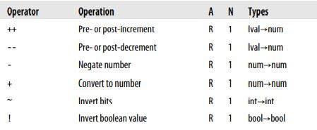
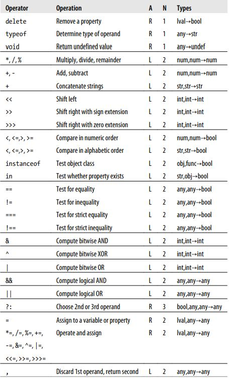

# 4장 표현식과 연산자

## 4.1 기본 표현식

자바스크립트에서 기본 표현식은 *상수, 리터럴 값, 특정 키워드들, 변수 참조* 를 말한다.

- 1.23
- "hello"
- /pattern/ (정규 표현식)
- true
- false
- null
- this
- undefined 

         리터럴(Literal) : 문자, 기호를 사용하여 값을 생성하는 표기 방식
         undefined : 선언한 후 값이 주어지지 않은 변수, 인수에 자동으로 할당
         null : 어떤 값이 의도적으로 비어있음을 표현

## 4.2 객체와 배열의 초기화 표현식

새로 생성된 객체나 배열을 값으로 하는 표현식 (객체 리터럴/ 배열 리터럴)
- 배열 ==> ( [], [1+2, 3+5], [1,,,,5], [[],[]])
- 객체 ==> ( {},{x:2, y:4},{x:{}, y:{}} ) 

## 4.3 함수 정의 표현식
새로 정의 된 함수(함수 리터럴)
- var fn = function(x) { return x * x ; }
	
## 4.4 프로퍼티 접근 표현식
객체의 프로퍼티 , 배열의 원소값
- 표현식 . 식별자  => obj.x;
-  표현식 [ 표현식 ] => array[1];

## 4.5 호출 표현식
function 이나 method를 호출하는 문법
- f(0)
- Math.max(x,y,z)
- a.sort()

## 4.6 객체 생성 표현식
새 객체를 생성하고, 생성자라고 부르는 함수를 호출해 객체에 속한 프로퍼티들을 초기화한다.
new 키워드를 사용하는 점을 제외하면 호출 표현식과 유사하다.
- new Object()
- new Point(2,3)

생성자 함수를 전달인자 없이 호출할 때, 괄호는 생략이 가능하다.

## 4.7 연산자 개요
    

